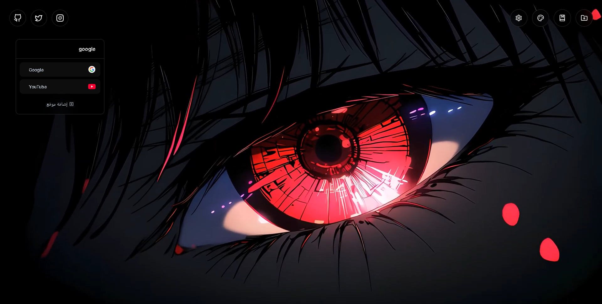
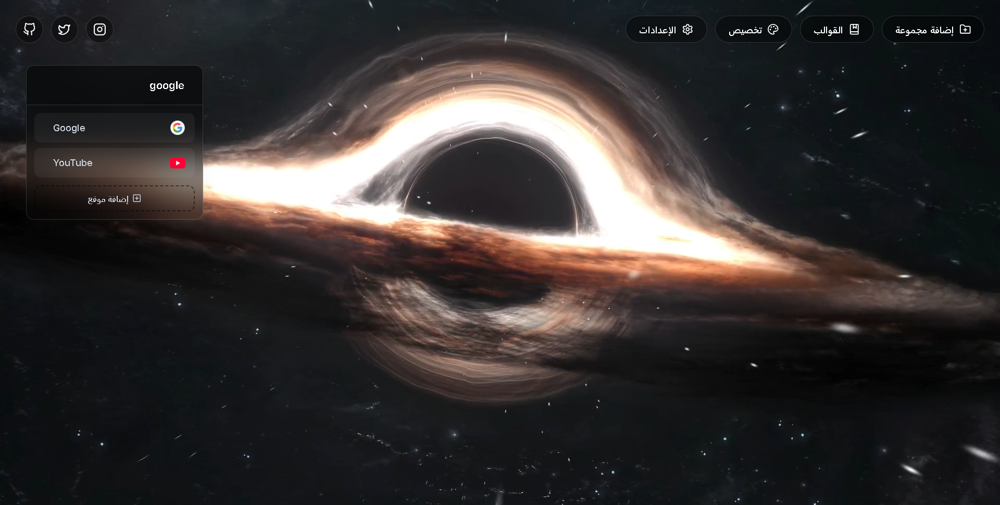

# ControlTap

A beautifully tailored New Tab experience. Minimalist, distraction-free, and purely customizable.

## Installation Guide

Since ControlTap is in Beta and running locally, follow these simple steps to install it:

1. **Download the Extension:** Click on `Code` -> `Download ZIP` in this repository, then extract the ZIP file to a safe, permanent folder on your computer.
2. **Access Extension Settings:** Open Chrome and type `chrome://extensions` in the address bar (or `edge://extensions` for MS Edge).
3. **Enable Developer Mode:** Turn on the **"Developer mode"** toggle switch, usually located in the top-right corner of the screen.
4. **Load the Project:** Click the **"Load unpacked"** button that appears on the top-left.
5. **Select the Folder:** Browse your files and select the folder you extracted in step 1.
6. **Confirm:** Open a new tab. If the browser asks if you want to keep the changes, click **Keep it**.

## Core Experience

- **Multi-Page Workspaces**: Drag, drop, and organize bookmarks effortlessly across dynamic pages.
- **Zero Friction**: In-place inline renaming for groups and pages—no pop-ups.
- **Smart Widgets**: Minimal search bar + adaptive clocks (Analog & Digital).

## Aesthetics

- **Curated Themes**: 11 sleek video and image backgrounds with matched accent colors.
- **Your Canvas**: Upload custom hi-res videos or photos directly to local storage.
- **Absolute Control**: Grid sizing (2–12 cols), variable card scaling, and global dark/light modes.
- **Pure Zen**: Switch to "Simple Mode" for a focused, icon-only layout.

## Under the Hood
Vanilla HTML/CSS/JS • MVC Architecture • IndexedDB • SortableJS 

---
*Designed for deep focus.*